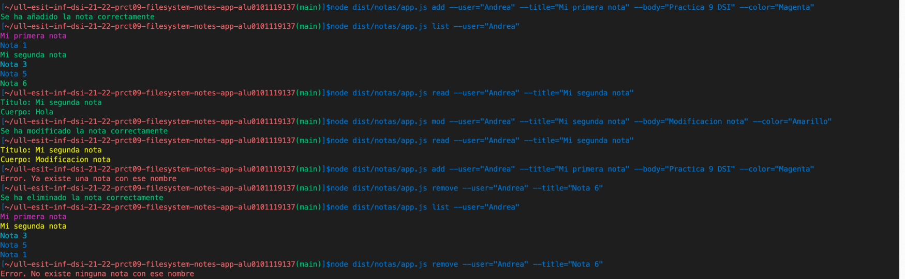
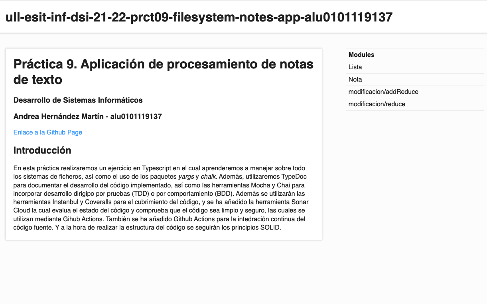
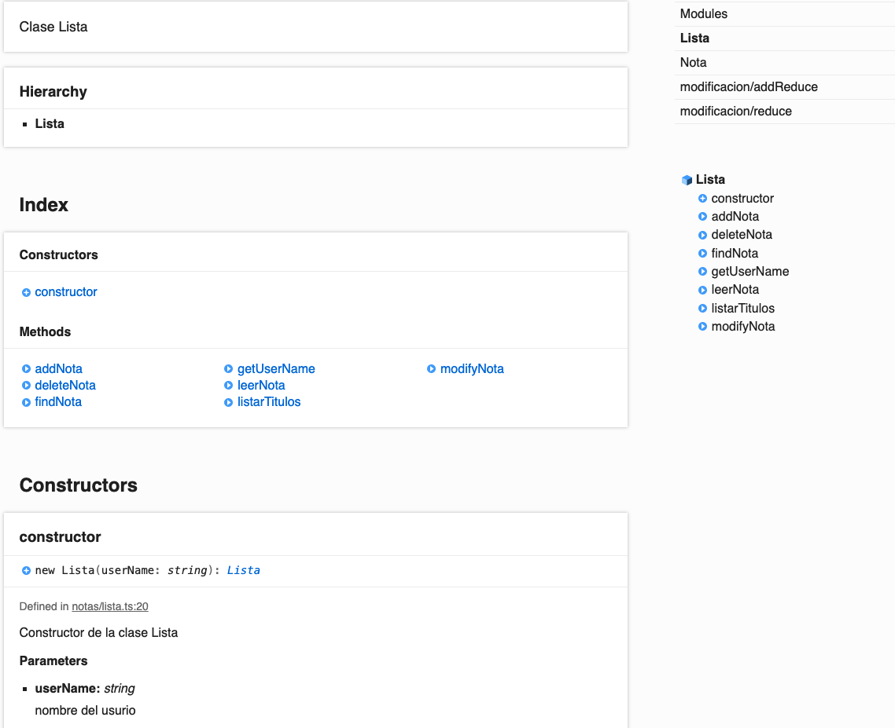

# Práctica 9. Aplicación de procesamiento de notas de texto
### Desarrollo de Sistemas Informáticos
### Andrea Hernández Martín - alu0101119137
[Enlace a la Github Page](https://ull-esit-inf-dsi-2122.github.io/ull-esit-inf-dsi-21-22-prct09-filesystem-notes-app-alu0101119137/)

## Introducción  
En esta práctica realizaremos un ejercicio en Typescript en el cual aprenderemos a manejar sobre todo los sistemas de ficheros, así como el uso de los paquetes *yargs* y *chalk*. Además, utilizaremos TypeDoc para documentar el desarrollo del código implementado, así como las herramientas Mocha y Chai para incorporar desarrollo dirigipo por pruebas (TDD) o por comportamiento (BDD). Además se utilizarán las herramientas Instanbul y Coveralls para el cubrimiento del código, y se ha añadido la herramienta Sonar Cloud la cual evalua el estado del código y comprueba que el código sea limpio y seguro, las cuales se utilizan mediante Gihub Actions. También se ha añadido Github Actions para la intedración continua del código fuente. Y a la hora de realizar la estructura del código se seguirán los principios SOLID.


## Procesamiento de notas de texto
En este ejercicio se nos pide implementar una aplicación que procese notas de texto con un color deseado para un usuario concreto, de manera que el usuario podrá añadir, modificar, ver todas las notas, etc. Para realizar dicha práctica, se tiene que utilizar el paquete yargs para el uso del usuario por consola y el paquete chalk para enseñar las notas con los colores deseados.  

A la hora de llevar a cabo la aplicación, he creado dos clases, **Nota** y **Lista**, las cuales se comentarán a continuación. Para poder pasarle al programa mediante la consola los datos necesarios para su uso, se ha utilizado el paquete yargs el cual he implementado en un fichero aparte llamado `app` y será el encargado de poner en funcionamiento la aplicación.  

- **Clase Nota:** esta clase es una clase sencilla y es la encargada de describir y almacenar los datos necesarios de una nota. Para ello, la nota recibe en el constructor su nombre, el texto con el contenido de la nota y el color con el que se quiere mostrar la nota por pantalla. Además implementa varios métodos los cuales son los `getters` de sus atributos, es decir, un getter para el nombre, otro para el texto y otro para el color. También se implementa otro método `getNota` que lo que hace es devolver un string con el contenido entero de la nota, indicando el título, el cuerpo y el color de esta. Por útlimo, tiene un método `print` que muestra la nota con su color correspondiente.  
**Código:**
```ts
export class Nota {
  constructor(private titulo: string, private cuerpo: string, private color: string) {}
  getTitulo(): string {
    return this.titulo;
  }
  getCuerpo(): string {
    return this.cuerpo;
  }
  getColor(): string {
    return this.color;
  }
  getNota(): string {
    const nota: string = `"Titulo": "${this.titulo}",\n"Cuerpo": "${this.cuerpo}",\n"Color": "${this.color}"`;
    return nota;
  }
  print(): void {
    switch (this.color) {
      case 'Rojo':
        console.log(chalk.default.red(this.getNota()));
        break;
      case 'Verde':
        console.log(chalk.default.green(this.getNota()));
        break;
      case 'Azul':
        console.log(chalk.default.blue(this.getNota()));
        break;
      case 'Amarillo':
        console.log(chalk.default.yellow(this.getNota()));
        break;
      case 'Magenta':
        console.log(chalk.default.magenta(this.getNota()));
        break;
      case 'Cian':
        console.log(chalk.default.cyan(this.getNota()));
        break;
      default:
        console.log(chalk.default.red('Error. Este color no está disponible'));
        break;
    }
  }
}
```
- **Clase Lista:** esta clase es la encargada de realizar las operaciones de un usuario con las notas, es decir, la encargada de modificar una nota, añadir otra, eliminarla, etc. Para ello, en el constructor de dicha clase recibe como parámetro el nombre del usuario, ya que un usuario no va a poder eliminar ni ver las notas de otros usuarios. Para acceder al nombre del usuario se creó un `getter` de dicho atributo. Luego, la clase tiene varios métodos más complejos que se van a comentar a continuacion:
    - *findNota*: este método recibe el nombre de la nota que quiere buscar en el directorio del usuario y retorna verdadero en caso de que haya encontrado la nota y falso en caso contrario.  
    **Código:**
    ```ts
    findNota(nombre: string): boolean {
      return (existsSync(`./${this.userName}/${nombre}.json`)) ? true : false;
    }
    ```
    - *addNota*: con este método permitimos al usuario añadir una nota a su directorio que contiene todas las notas, en caso de que dicho directorio no exista debido a que es la primera nota que se introduce, se crea el directorio con el nombre del usuario y dentro la nota que se quiere añadir. Si la nota se añade se muestra por consola un mensaje indicando que se ha añadido correctamente, en el caso de que el nombre de la nota ya exista, muestra un mensaje de error, ya que no pueden haber dos notas con el mismo título.  
    **Código:**
    ```ts
    addNota(nuevaNota: Nota): void {
      if (!this.findNota(nuevaNota.getTitulo())) {
        writeFile(`./${this.userName}/${nuevaNota.getTitulo()}.json`, `{\n${nuevaNota.getNota()}\n}`, (err) => {
          if (!err) {
            console.log(chalk.default.green('Se ha añadido la nota correctamente'));
          }
        });
      } else {
        console.log(chalk.default.red('Error. Ya existe una nota con ese nombre'));
      } 
    }
    ```
    - *modifyNota*: con este método permitimos al usuario modificar una nota existente, en caso de que dicha nota no exista, se muestra un mensaje de error indicando que el nombre de la nota no existe. En caso de que si exista, se modifica la nota escribiendo en ella, los datos que recibe la función, los cuales son el nombre de la nota, el texto nuevo que se quiere escribir en la nota y su color nuevo.  
    **Código:**
    ```ts
    modifyNota(nombre: string, nuevoTexto: string, nuevoColor: string): void {
      if (this.findNota(nombre)) {
        writeFile(`./${this.userName}/${nombre}.json`, `{\n"Titulo": "${nombre}",\n"Cuerpo": "${nuevoTexto}",\n"Color": "${nuevoColor}"\n}`, (err) => {
          if (!err) {
            console.log(chalk.default.green('Se ha modificado la nota correctamente'));
          }
        });
      } else {
        console.log(chalk.default.red('Error. No existe ninguna nota con ese nombre'));
      }
    }
    ```
    - *deleteNota*: a este método se le pasa el nombre de la nota que se quiere eliminar permitiendo así al usuario eliminar una nota existente, en caso de que dicha nota no exista, se muestra un mensaje de error indicando que el nombre de la nota no existe. En caso de que si exista, se elimina la nota mediante `spawn('rm', ...)`.  
    **Código:**
    ```ts
    deleteNota(nombre: string): void {
      if (this.findNota(nombre)) {
        spawn('rm', [`./${this.userName}/${nombre}.json`]);
        console.log(chalk.default.green('Se ha eliminado la nota correctamente'));
      } else {
        console.log(chalk.default.red('Error. No existe ninguna nota con ese nombre'));
      }
    }
    ```
    - *listarTitulos*: con este método permitimos al usuario mostrar todos los títulos de las notas que están en su directorio de notas, en caso de que dicho usuario no tenga ninguna nota muestra por pantalla un mensaje de error indicando que no hay notas que mostrar. En caso de que si tenga notas, muestra por pantalla los títulos de las notas con su correspondiente color.  
    **Código:**
    ```ts
    listarTitulos(): void {
      if (existsSync(`./${this.userName}`)) {
        const lista = readdirSync(`./${this.userName}`);
        lista.forEach((nota) => {
          readFile(`./${this.userName}/${nota}`, (err, data) => {
            if (!err) {
              const dataJson = JSON.parse(data.toString());
              switch (dataJson.Color) {
                case 'Rojo':
                  console.log(chalk.default.red(dataJson.Titulo));
                  break;
                case 'Verde':
                  console.log(chalk.default.green(dataJson.Titulo));
                  break;
                case 'Azul':
                  console.log(chalk.default.blue(dataJson.Titulo));
                  break;
                case 'Amarillo':
                  console.log(chalk.default.yellow(dataJson.Titulo));
                  break;
                case 'Magenta':
                  console.log(chalk.default.magenta(dataJson.Titulo));
                  break;
                case 'Cian':
                  console.log(chalk.default.cyan(dataJson.Titulo));
                  break;
                default:
                  console.log(chalk.default.red('Error. Este color no está disponible'));
                  break;
              }
            }
          });
        });
      } else {
        console.log(chalk.default.red('Error. No existen listas para este usuario'));
      }
    }
    ```
    - *leerNota*: este método permite al usuario leer el cuerpo de una nota específica, para ello la función recibe como parámetro el nombre de la nota se que quiere leer. LA implementación de este método es muy parecida a la del método anterior. En caso de que la nota se que quiera leer no exista, se muestra un mensaje de error por la consola; en caso contrario, muestra por consola el título de la nota y el cuerpo con su color correspondiente.   
    **Código:**
    ```ts
    leerNota(nombre: string): void {
      if (this.findNota(nombre)) {
        readFile(`./${this.userName}/${nombre}.json`, (err, data) => {
          if (!err) {
            const dataJson = JSON.parse(data.toString());
            switch (dataJson.Color) {
              case 'Rojo':
                console.log(chalk.default.red(`Titulo: ${dataJson.Titulo}\nCuerpo: ${dataJson.Cuerpo}`));
                break;
              case 'Verde':
                console.log(chalk.default.green(`Titulo: ${dataJson.Titulo}\nCuerpo: ${dataJson.Cuerpo}`));
                break;
              case 'Azul':
                console.log(chalk.default.blue(`Titulo: ${dataJson.Titulo}\nCuerpo: ${dataJson.Cuerpo}`));
                break;
              case 'Amarillo':
                console.log(chalk.default.yellow(`Titulo: ${dataJson.Titulo}\nCuerpo: ${dataJson.Cuerpo}`));
                break;
              case 'Magenta':
                console.log(chalk.default.magenta(`Titulo: ${dataJson.Titulo}\nCuerpo: ${dataJson.Cuerpo}`));
                break;
              case 'Cian':
                console.log(chalk.default.cyan(`Titulo: ${dataJson.Titulo}\nCuerpo: ${dataJson.Cuerpo}`));
                break;
              default:
                console.log(chalk.default.red('Error. Este color no está disponible'));
                break;
            }
          } else {
            console.log(chalk.default.red('Error. No se pudo leer la nota deseada'));
          }
        });
      } else {
        console.log(chalk.default.red('Error. No existe una nota con ese nombre'));
      }
    }
    ```
- **Fichero App:**  este fichero se encarga de poner en funcionamiento el programa mediando el paquete `yargs`, se implementan los comandos `add`, `mod`, `remove`, `list`, `read` para que el usuario de la aplicación pueda utilizar los métodos necesarios para operar con las notas.  

## Ejemplo de uso de la aplicación  


## Documentación TypeDoc  
Para la documentación de los ejercicios utilicé la herramienta TypeDoc que convierte los comentarios en el código fuente de TypeScript en documentación HTML renderizada. A continuación, adjunto el enlace a la página web creada mediante TypeDoc.  
[Enlace repositorio documentación Typedoc](https://github.com/ULL-ESIT-INF-DSI-2122/ull-esit-inf-dsi-21-22-prct09-filesystem-notes-app-alu0101119137/tree/main/docs) 

 

## Testing
Para la realización del testing de los ejercicios utilicé las herramientas Mocha y Chai.  
  
He realizado pruebas sobre la aplicación en los cuales compruebo que los valores pasados por parámetro dan el resultado esperado o al contrario, es decir, se comprueba que no dan el resultado esperado. Para ello he creado un fichero clase.spec.ts por cada clase implementada y he añadido algunas pruebas de todas las funciones utilizadas.  

A continuación muestro la salida en la terminal al ejecutar el test.  
```
Tests de la clase Lista
    ✔ Se crea correctamente una instancia de la Lista
    ✔ Se accede al nombre del usuario de la lista correctamente
    ✔ Funciona el método encontrar una nota correctamente
    ✔ Funciona el método añadir una nota a la lista correctamente
    ✔ Funciona el método listar todos los nombres de las notas correctamente
    ✔ Funciona el método leer nombre y cuerpo de una nota correctamente
    ✔ Funciona el método modificar una nota de la lista correctamente
    ✔ Funciona el método eliminar una nota de la lista correctamente

  Tests de la clase Nota
    ✔ Se crea una clase Nota correctamente
    ✔ Se accede al título de la nota correctamente
    ✔ Se accede al cuerpo de la nota correctamente
    ✔ Se accede al color de la nota correctamente
    ✔ Se accede a la información completa de la nota correctamente
    ✔ Se imprime por consola la nota correctamente

  18 passing (74ms)
```

## Configuración de Coveralls y Github Actions  
[](https://coveralls.io/github/ULL-ESIT-INF-DSI-2122/ull-esit-inf-dsi-21-22-prct09-filesystem-notes-app-alu0101119137?branch=main)
[](https://github.com/ULL-ESIT-INF-DSI-2122/ull-esit-inf-dsi-21-22-prct09-filesystem-notes-app-alu0101119137/actions/workflows/node.js.yml)
[](https://sonarcloud.io/summary/new_code?id=ULL-ESIT-INF-DSI-2122_ull-esit-inf-dsi-21-22-prct09-filesystem-notes-app-alu0101119137)

## Conclusiones  
Esta práctica me ha resultado bastante sencilla e interesante, debido a que he aprendido a utilizar el paquete yargs con el que no había trabajado nunca y me pareció bastante útil, además al utilizar el paquete chalk para los colores de la nota me pareció muy interesante y una forma nueva de ver los datos de la consola de manera más bonita. La parte que me resultó más compleja fue la parte de cómo leer de un directorio todas las notas que habían, pero supe realizarla buscando en la documentación de Nodejs. En cuanto a la parte de documentación y testing al haberla realizado en todas las prácticas anteriores no me ha supuesto ningún inconveniente. Al igual que coveralls y sonarcloud, las cuales se han realizado con las github actions.  

## Bibliografía  
- [Guión de la práctica]()
- [Documentación TypeDoc](https://typedoc.org/)
- [Documentación Mocha](https://mochajs.org/)
- [Documentación Chai](https://www.chaijs.com/)
- [Documentación Instanbul](https://istanbul.js.org/)
- [Documentación Coveralls](https://coveralls.io/)
- [Sonar Cloud](https://sonarcloud.io/)
- [Documentación Yargs](https://www.npmjs.com/package/yargs)
- [Documentación Chalk](https://www.npmjs.com/package/chalk)
- [Node.js](https://nodejs.org/docs/latest-v17.x/api/)
- [Apuntes de clase sobre node.js.](https://ull-esit-inf-dsi-2122.github.io/nodejs-theory/nodejs-intro.html)
- [Apuntes de clase sobre el sistema de ficheros](https://ull-esit-inf-dsi-2122.github.io/nodejs-theory/nodejs-filesystem.html)